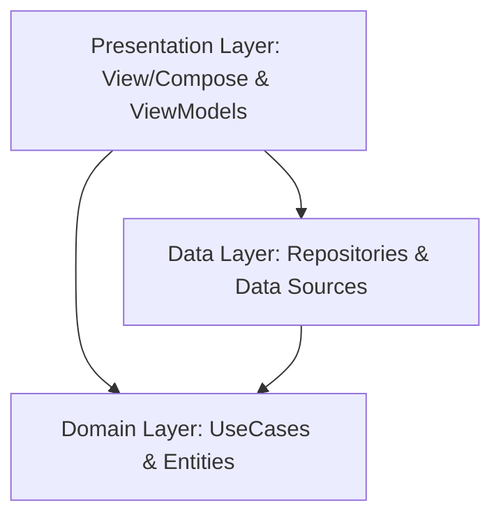

# 01. Arquitectura de GlobalConsole

Este documento detalla el patrón de arquitectura de software y los principios de diseño que rigen el desarrollo de GlobalConsole.

---

## 🏗️ 1. Clean Architecture y MVVM

GlobalConsole implementa estrictamente **Clean Architecture** estructurado en el patrón **MVVM** (Model-View-ViewModel). El objetivo es separar la interfaz de usuario de la lógica de negocio y las operaciones de datos, permitiendo una fácil extensibilidad (por ejemplo, para agregar más emuladores en el futuro) y facilitando las pruebas unitarias.

### Capas del Sistema

1. **Domain Layer (Capa de Dominio)**
   - Contiene las entidades puras de negocio y los casos de uso (`UseCases`).
   - Es completamente independiente de frameworks externos de persistencia, de red o de interfaz de usuario.
   - Todo cambio o nueva característica debe iniciarse definiendo sus entidades y lógica en esta capa.

2. **Data Layer (Capa de Datos)**
   - Implementa los contratos (interfaces de repositorios) definidos en la capa de dominio.
   - Contiene los adaptadores, bases de datos, accesos al sistema de archivos y llamadas de red.
   - En nuestro caso, maneja la lectura del sistema de archivos para buscar archivos ISO a través de `GameP2FileSystemAdapter` y la ejecución del emulador mediante `GamePCSX2Adapter`.

3. **Presentation Layer (Capa de Presentación)**
   - Contiene las pantallas escritas en Compose Multiplatform y los `ViewModels` correspondientes.
   - Se enfoca de forma exclusiva en la experiencia "10-foot UI" de consola (televisión a distancia).
   - **Regla de Interfaz Interactiva:** Todo elemento que sea accionable o clicable (`clickable`) en la aplicación DEBE tener implementado un estado visual `hoverable` y reaccionar a él (invirtiendo colores o destacándose). Esto es debido a que el usuario puede interactuar tanto a través del movimiento tradicional de foco por cruceta (D-Pad) como mediante el ratón virtual movido con el stick derecho del gamepad. Nunca se deben usar componentes clicables ciegos.

---

## 🧪 2. Principios de Pruebas (TDD)

El desarrollo del proyecto sigue la metodología **Test-Driven Development (TDD)** con las siguientes pautas:
- Los tests deben escribirse **antes** que el código de producción.
- El alcance de los tests automáticos se limita **exclusivamente a los `UseCases`** (lógica de negocio).
- Se permite simular la capa de datos mediante mocks o implementaciones falsas (Fakes) de los repositorios para aislar la lógica del caso de uso.
- Las pruebas se implementan con el framework estándar **kotlin.test**.

---

## 🔗 3. Referencias Cruzadas
- Consultar las versiones y justificaciones de librerías en [02_tecnologias.md](02_tecnologias.md).
- Ver la disposición física de los módulos y paquetes en [03_modulos.md](03_modulos.md).
- Comprender la arquitectura de ejecución de emuladores en [04_pcsx2.md](04_pcsx2.md).
